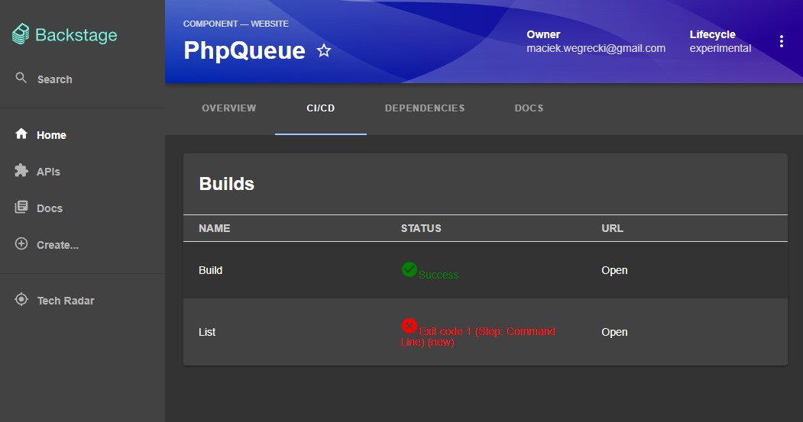

# teamcity

Welcome to the teamcity plugin!

_This plugin was created through the Backstage CLI_

## Getting started

In: packages\app\src\components\catalog\EntityPage.tsx file add:
```
import { TeamcityFetchComponent } from '@internal/plugin-teamcity/src/components/TeamcityFetchComponent';
import { isTeamcityAvailable } from '@internal/plugin-teamcity';
```

Then under cicdContent:
```
    <EntitySwitch.Case if={isTeamcityAvailable}>
        <Grid item sm={12}>
            <TeamcityFetchComponent/>
        </Grid>
    </EntitySwitch.Case>
```

As a final step add the proxy to the app-config.local.yaml or prod depending on the env.

```
proxy:
  '/teamcity-proxy/':
    target: 'http://localhost:8111'
    headers:
      Authorization: 'Basic BASIC_AUTH'
      Accept: 'application/json'
```

# Project catalog flag requirement
```
  annotations:
    teamcity/project-id: TEAMCITY_NAME
```


# Screenshot
